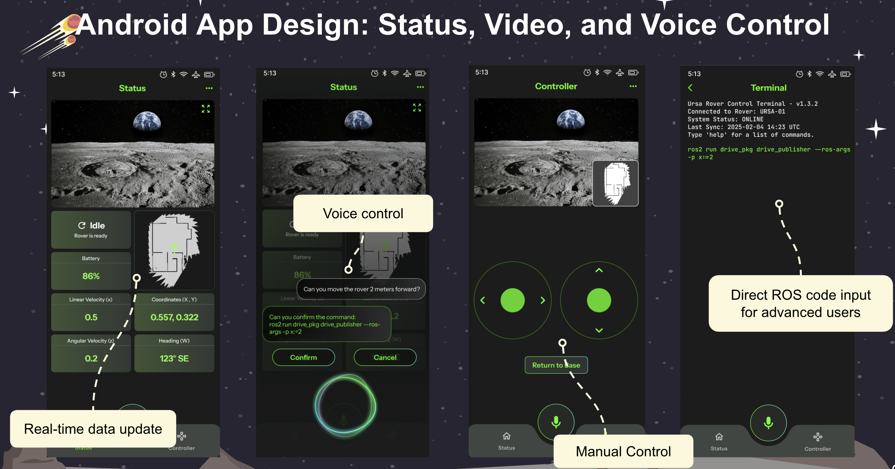

# About Hitch Play

Hitch Play is an open-source project that implements a local Large-Language-Model (LLM) on smart phones to act as an AI voice assistant to help programming and controlling compatible rover vehicles. The user can issue rover navigation commands directly to the AI voice assistant, and the embedded LLM model will turn that into supported command code in Robot OS (ROS).

The current implementation has been tested using a 3B Llama2 model, running on Qualcomm's optimized 8-Elite processor. The local LLM model, in turn, is qualitzed from Qualcomm's AI Hub.

## Description
Hitch Play contains two parts, which should be installed separately.
1. C++ code on the rover with ROS2: A piece of ROS2 server code needs to be installed to receive API calls from the smartphone and then respond with the requested data. Currently we tested the code with a Jetson Nano board connected to a Leo Rover.
   
2. Hitch Play app on Android: We tested the app running Androind version 15 on Qualcomm's 8-Elite processor.

Here is a short demo video:
[Hitch Play Demo](https://drive.google.com/file/d/1GatD-wnXYO9-Zkg2-0efDdhuACMSJTps/view)

## License
This project is licensed under GNU Affero General Public License (AGPL).

This project includes third-party code in ursa directory licensed separately:
- Qualcomm BSD-3-Clause License ([qualcomm-bsd3-clause.txt](third-party-licenses/qualcomm-bsd3-clause.txt))

## Contributors
* Rover ROS2 Server: Kai Mohl, Franco Huang, Tianlun Zhang, Alex Nan, Michael Wu, and Dr. Allen Y. Yang

(c) Copyright, 2025.