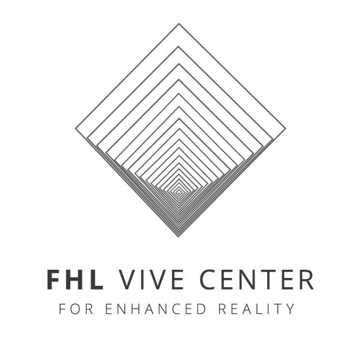

<div align="center">
  

  <h3>Ursa</h3>
  <p><strong>From Speech to Action: Voice Enabled Rover Control App using Large Language Model</strong></p>

  <table align="center">
    <tr>
      <td></td>
      <td></td>
      <td></td>
    </tr>
  </table>
</div>

<details>
<summary><strong>Table of Contents</strong></summary>

- [About the Project](#about-the-project)
- [Demo](#demo)
- [Key Features](#key-features)
- [System Architecture](#system-architecture)
- [Technical Stack](#technical-stack)
- [Getting Started with the App](#getting-started-with-the-app)
- [Attribution](#attribution)
- [License](#license)

</details>

## About the Project

Ursa is an Android application that converts natural language user commands into machine code instructions for robotic control, leveraging an on-device large language model (LLM). This project currently employs **Qwen 2.5-7B-Instruct** (previously LLaMA 3.2-3B) and integrates Qualcomm’s [Chat App Demo](https://github.com/quic/ai-hub-apps/tree/main/android/ChatApp). Sponsored by **Qualcomm**.

## Demo

[](https://youtu.be/QfCmIGPUlbI)

## Key Features
- Natural language to ROS2 code translation using Qwen 2.5-7B-Instruct and Whisper-tiny.en
- On-device model inference with Qualcomm Genie runtime and QAI Hub binaries
- Support for both manual control and real-time voice input
- Real-time telemetry, video streaming, and occupancy map display
- Fully offline operation; secure, responsive, and mobile-optimized

## System Architecture

```plaintext
[ Android UI: Voice/Text Input ]
               ↓
[ Whisper Model (STT) ]
               ↓
[ Qwen 2.5-7B-Instruct Inference (Genie Runtime) ]
               ↓
[ ROS2 Code Generation ]
               ↓
[ Rover Communication Layer ]
```

## Technical Stack


**Frontend**: Kotlin/Java (Android Studio)  
**Backend**:  
- Whisper-tiny.en (speech-to-text)  
- Qwen 2.5-7B-Instruct (natural language to code generation)  
- Qualcomm Genie runtime for inference

**Hardware**: Qualcomm Snapdragon 8 Elite / 8 Gen 3 / 8 Gen 2


## Getting Started with the App

See **[BUILD_GUIDE.md](BUILD_GUIDE.md)** for complete instructions covering:
- Prerequisites (Gradle 8.9, QNN SDK, NDK)
- Building the APK and deploying to device
- Side-loading model weight files via adb
- Swapping to a different LLM model
- Performance tuning

## Attribution

Portions of the codebase and documentation are adapted from the Qualcomm Chat App Demo, 
including the Llama wrapper and Genie runtime integration guides. 
Modifications have been made to align with the project’s natural language to machine code 
conversion goals.

All original Qualcomm copyrights and license terms apply.

## LICENSE

This project includes licensed components from Qualcomm Technologies, Inc. Qualcomm® AI Hub Apps is licensed under BSD-3. See the [LICENSE file](../LICENSE).
